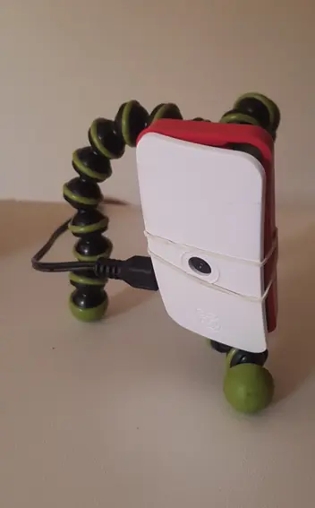
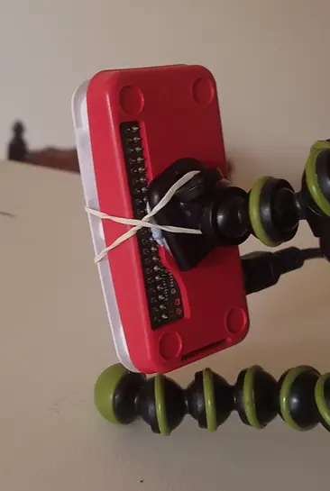

# WiFi security / monitoring camera, using a Raspberry Pi Zero W

# parts list
- [Raspberry Pi Zero W](https://www.raspberrypi.org/pi-zero-w/)
  - make sure to get one _without_ header pins, as the camera lid does not fit
    when the header pins are attached
- [official raspberry pi zero case](https://www.raspberrypi.org/products/raspberry-pi-zero-case/)
- [NoIR camera module](https://www.raspberrypi.org/products/pi-noir-camera-v2/)
  - I used a V1, but the V2 looks to be the same size
- 16GB SD card
- 2.5A 5V power supply
- infrared (IR) spotlight + 12V supply
  - possibly from [Jaycar?](https://www.jaycar.com.au/infrared-security-spotlight/p/QC3652)
- generic flexible camera tripod
- blu-tack, rubber bands
  - to stick the case to the tripod

# software
- [Raspberry Pi OS Lite](https://www.raspberrypi.org/software/operating-systems/)
  - Setup instructions [here](https://github.com/uozuAho/pi_stuff/blob/main/setup.md)

# usage
I used [termux](https://termux.com/) to log into the raspberry pi and start the
video stream, and [VLC for Android](https://www.videolan.org/vlc/download-android.html)
to watch the stream. This made it easy to position the camera.

- [video stream script](https://github.com/uozuAho/pi_stuff/blob/main/video_stream.sh)
- [video record script](https://github.com/uozuAho/pi_stuff/blob/main/video_record_loop.sh)
- [scan for motion script](https://github.com/uozuAho/pi_stuff/blob/main/video_scan.sh)

# issues
- attaching the case to the tripod with blutack and rubber bands isn't ideal
- needing a separate IR spotlight is a hassle
- cannot stream video and record at the same time. If you want to do that, look
  into
  - [motion](https://motion-project.github.io/index.html)
  - [motioneyeos](https://github.com/ccrisan/motioneyeos)
